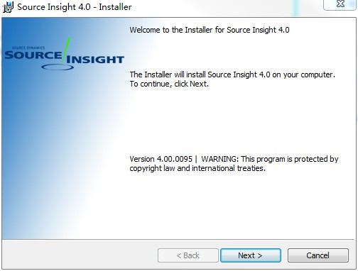
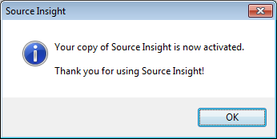
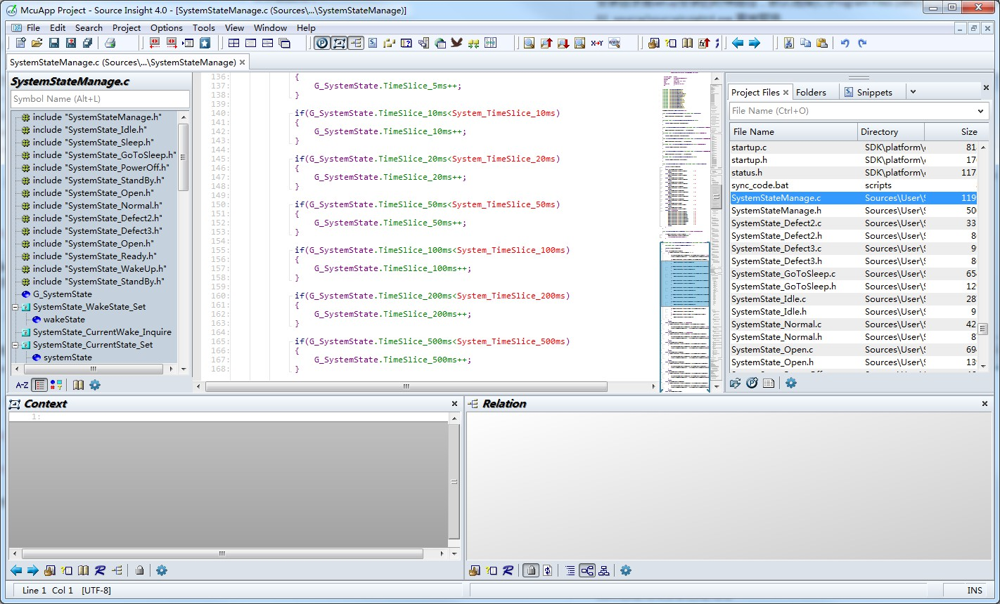

# Source-Insight-4.0-Share
source in sight 4 分享介绍 官网地址 https://www.sourceinsight.com/


## 1.安装

最新版 Source Insight 4.0.0095[2018/8/21官网更新目前来看是最新版]，[参考](https://bbs.pediy.com/thread-215669-1.htm) 安装截图如下:

### 1.1 安装文件说明
打开 文件夹 **02_source**,里面有3个文件,分别说明如下

| 文件 | 描述 | 备注 |
| :------: | :------: | :------: |
| si4.pediy.lic | source in sight 授权文件 | 这个重要 |
| sourceinsight4.exe | 破解软件启动文件 | N/A|
| sourceinsight4095-setup.exe | 原版安装软件 | 最新4.0.0095 [2018/8/21]|

- 1 首先安装setup软件




一路next,需要同意点下同意，选择默认安装地址[C:\Program Files (x86)\Source Insight 4.0\],如果有需求可以更改下，然后点finish完成

- 2 寻找安装目录替换 sourceinsight4.exe

安装目录是setup安装的时候路径，默认选择[C:\Program Files (x86)\Source Insight 4.0\],然后将 02_source/sourceinsight4.exe 直接替换

- 3 然后打开后导入授权文件 si4.pediy.lic




此时已经完成安装已经完成



## 2 使用


[source in sight 4](https://www.sourceinsight.com/) 相比 source in sight 3.5 多了很多特性，在用的这几天，最明显感受就是标签栏，编码格式可以更改（默认UTF8），代码折叠，点击单词自动高亮相同单词,代码缩略图和代码片段等等，这些优点集合使用流畅度和UI完全可以取代目前的 3.5,以下针对比较特别的特性需要讲述下

- 1.关于代码颜色主题配置

    首先配置是很主观，个人倾向于偏淡风格，故有了模仿 vscode 的 Light+ 颜色主题，这个主题颜色比较符合早期使用的vc6.0风格，该配置文件已经放在 **03_plug_in/Light+.xml **,然后打开菜单栏 Options|Load Configuration,可以直接加入此配置

    当然也可以自己更改需要在 Options|Style Properties 进行一些代码颜色配置，当然可以保存这些，在Options|Save Configuration 保存自己配置[生成XML保存]，如果不想更改配置，想尝试其它的主题，直接点 Options|Visual Theme 进行各种快速切换

- 2.关于插件
    插件和source in sight 3.5是兼容的，可以直接使用，个人推荐Switch_cpp_hpp.em这个插件[在03_plug_in\Switch_cpp_hpp.em]，可以快速切换同名头文件和C文件，配合 按键设置，可以很流畅切换，其中插件放在的位置 在**个人文档的 Source Insight 4.0\Projects\Base** 放置

- 3 关于 版本管理忽略 

由于 source in sight 4.0 是 产生的文件是不需要进入版本管理的，故提交的时候需要忽略，下面命令针对 git 忽略 source in sight 4.0 后缀名
```bash
# ignore source in sight 4.0 file
*.sip_xab
*.sip_xad
*.sip_xc
*.sip_xf
*.sip_xm
*.sip_xr
*.sip_xsb
*.sip_xsd
*.siproj
*.bookmarks.xml
*.siproj_settings.xml
*.snippets.xml
*.siwork
*.sip_sym
*.sisc
*.SearchResults

# ignore source in sight 4.0 backup file
*(*[0-9]).c
*(*[0-9]).cpp
*(*[0-9]).h
```


    


