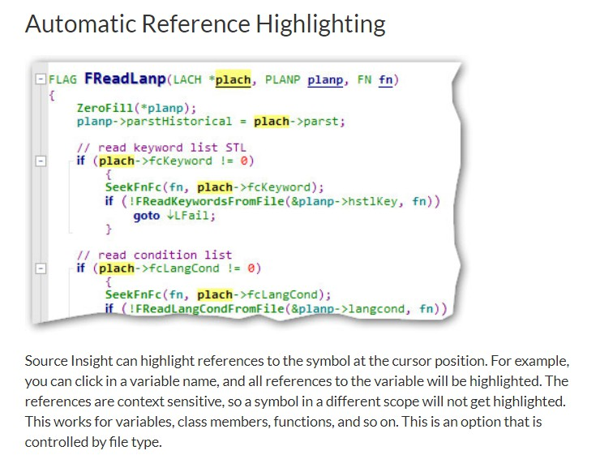

# Source-Insight-4.0-Share

source in sight 4 分享介绍 [官网](https://www.sourceinsight.com/)

## 1.概述

最新版 Source Insight 4.0.0095[2018/8/21官网更新目前来看是最新版]，[参考](https://bbs.pediy.com/thread-215669-1.htm) 安装截图如下:

## 2.正文

### 2.1安装介绍

打开 文件夹 **02_source**,里面有3个文件,分别说明如下

| 文件 | 描述 | 备注 |
| :------: | :------: | :------: |
| si4.pediy.lic | source in sight 授权文件 | 这个重要，破解需要此licence |
| sourceinsight4.exe | 破解软件启动文件 | N/A|
| sourceinsight4095-setup.exe | 原版安装软件 | 最新4.0.0095 [2018/8/21]|

- 1 首先安装setup软件
 


一路next,需要同意点下同意，选择默认安装地址[C:\Program Files (x86)\Source Insight 4.0\],如果有需求可以更改下，然后点finish完成

- 2 寻找安装目录替换 sourceinsight4.exe

安装目录是setup安装的时候路径，默认选择[C:\Program Files (x86)\Source Insight 4.0\],然后将 02_source/sourceinsight4.exe 直接替换

- 3 然后打开SOurceInSight4图标后导入授权文件 si4.pediy.lic


此时已经完成安装已经完成


## 2.2原生特性介绍

### 2.2.1 界面改版

- 1. Collapsible Code Blocks 折叠代码


- 2.Multiple Visual Themes 多虚拟主题


- 3.原生多标签，不需要第三方插件


- 4.Overview_Scroller 代码缩略图[可以关掉]


> 界面的改变，总之比较source in sight 3.5不管界面上还是编辑流畅度上还是更好一点。更多界面的变化参考[官网](https://www.sourceinsight.com/)

### 2.2.2 功能增加

- 1.Automatic Reference Highlighting 自动引用高亮显示



- 2.Code Beautifier 代码美化 ，这个功能可以用Astyle代替


> 可以使用 Astyle 格式化代码 ，加入到 command 中，再映射快捷键

- 3.Backup File Management 文件修改备份管理，可以比较历史纪录


- 4.和SourceInSight3.5配置兼容，可以在4.0用3.5配置

可以直接将 3.5中文档目录中base项目中的cf3 导入到 4.0中

- 5.支持更多的编码格式

之前 SourceInSight3.5 默认是ANSI（GBK）编码格式，在 source in sight 4.0中打开会注释有乱码（source in sight 4.0默认是UTF-8格式），可以选择编码格式为GBK，关于编码格式，个人倾向于注释全用英文比较号好，就不会又中文乱码问题


## 3.其它说明

### 3.1插件推荐

-1 Switch_cpp_hpp.em

在 **03_plug_in\Switch_cpp_hpp.em **中加入此插件，方法与 source in sight3.5一致，此插件功能可以迅速切换同名.c和.h文件非常方便切换

-2 doxygen.em

这个插件之前分享了下，主要是生成doxygen格式的编码规范

其中插件放在的位置 在**个人文档的 Source Insight 4.0\Projects\Base** 放置。当然还有其它比较好的插件，不一一介绍了，在我这边看来source in sight 4.0 已经更新了很好，之前一些诸如中文字符删除问题已经解决，标签插件原生的就很好，不需要其它类似插件。

### 3.2.gitignore 忽略4.0产生文件
由于 source in sight 4.0 是 产生的文件是不需要进入版本管理的，故提交的时候需要忽略，下面命令针对 git 忽略 source in sight 4.0 后缀名
```bash
# ignore source in sight 4.0 file
*.sip_xab
*.sip_xad
*.sip_xc
*.sip_xf
*.sip_xm
*.sip_xr
*.sip_xsb
*.sip_xsd
*.siproj
*.bookmarks.xml
*.siproj_settings.xml
*.snippets.xml
*.siwork
*.sip_sym
*.sisc
*.SearchResults

# ignore source in sight 4.0 backup file
*(*[0-9]).c
*(*[0-9]).cpp
*(*[0-9]).h
```

## 3.参考

| 参考 | 备注 | 
| :------: | :------: |
| [SourceInsight4.0的使用](https://blog.csdn.net/qq_39660930/article/details/77499455) | 针对SourceInsgiht4介绍的很详细 |
| [烤鸭的Source Insight学习笔记](https://blog.csdn.net/benkaoya/article/details/8296197)| 针对SourceInsgiht3.5介绍，可以参考借鉴  |


